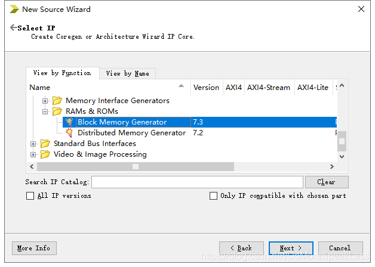
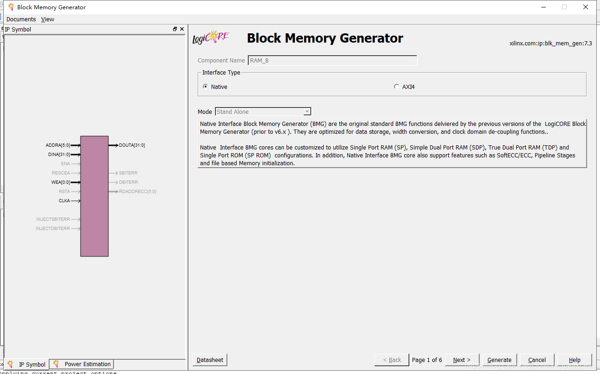
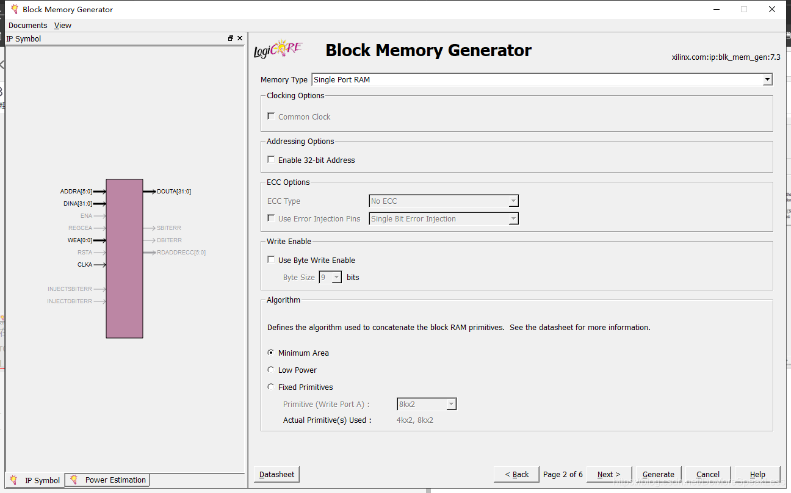
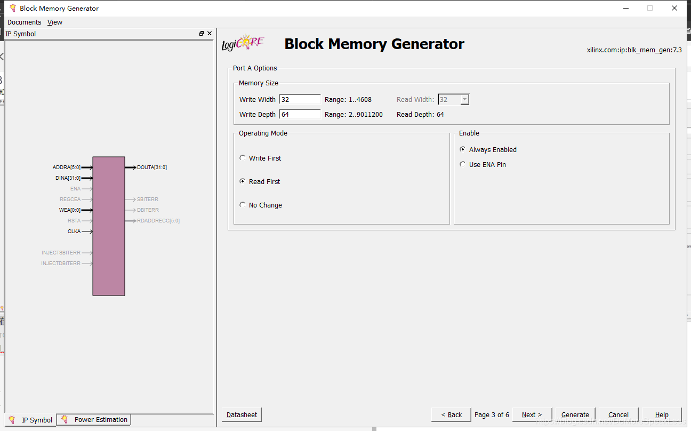
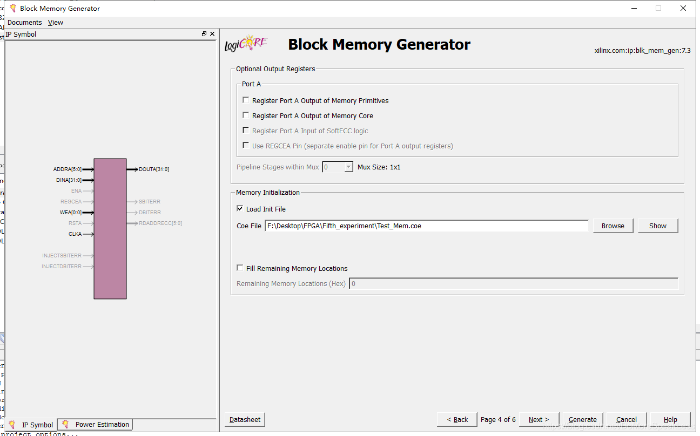
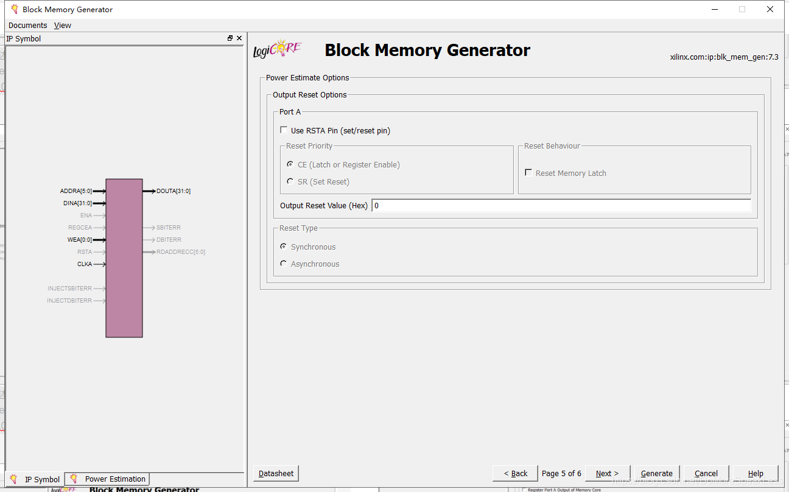
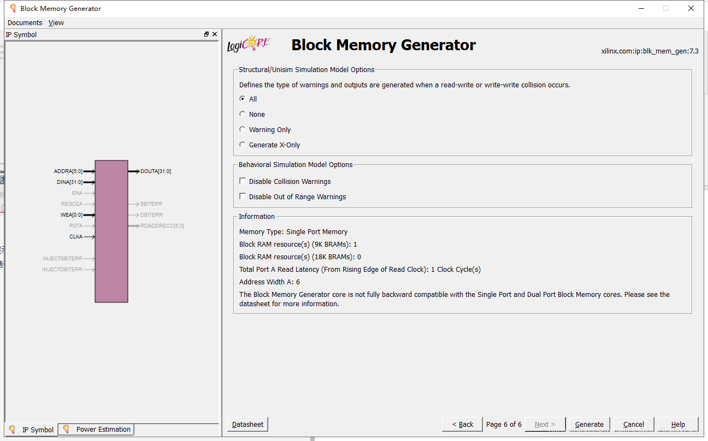

# 实验5-存储器设计实验
## 实验内容

1. 掌握灵活运用 Verilog HDL 进行各种描述与建模的技巧和方法
2. 学习在 ISE 中设计生成 Memory IP 核的方法
3. 学习存储器的结构及读写原理，掌握存储器的设计方法

## 解决方法

1. 分析一个 256x8 位的物理存储器，具有读 写功能，按字节编址，按字访问，
   即 64x32 位。
2. 首先，给出的 8 位存储器地址，只按照高 6 位访问存储器，而低 2 位必须为
   00
3. 我采用了两种方法进行设计存储器，首先是 MemoryIP 核
4. MemoryIP核只需按照书上步骤下来，贴几张步骤图，大家按照步骤下来
   
   
   **这里我选择的是同步存储器，由时钟控制；另一种是分布式存储器，不带时钟同步，也就是异步控制**
   
   
   
   
   
   

**5. MemoryIP代码展示：**

```verilog
module RAM(
input [7:2]Mem_Addr,
input [1:0]MUX,		
input Mem_Write,			
input Clk,			
output reg [7:0]LED);
wire [31:0]M_R_Data;	
reg [31:0]M_W_Data;	
RAM_B your_instance_name (
  .clka(Clk), // input clka
  .wea(Mem_Write), // input [0 : 0] wea
  .addra(Mem_Addr), // input [5 : 0] addra
  .dina(M_W_Data), // input [31 : 0] dina
  .douta(M_R_Data) // output [31 : 0] douta
);
always @(*)
	begin
	LED = 0;
	M_W_Data = 0;
	if(Mem_Write)
		begin 
		case(MUX)  
			2'b00:	M_W_Data = 32'h0000_000F;
			2'b01:	M_W_Data = 32'h0000_0DB0;
			2'b10:	M_W_Data = 32'h003C_C381;
			2'b11:	M_W_Data = 32'hFFFF_FFFF;	
		endcase 
		end
	else
		begin
			case(MUX)
				2'b00:	LED = M_R_Data[7:0];
				2'b01:	LED = M_R_Data[15:8];
				2'b10:	LED = M_R_Data[23:16];
				2'b11:	LED = M_R_Data[31:24];	
			endcase
		end
	
	end
endmodule

```

**Test_Mem.coe**

```verilog
memory_initialization_radix = 16;
memory_initialization_vector = 00000820,00632020,00010fff,20006789,ffff0000,0000ffff,88888888,99999999,aaaaaaaa,bbbbbbbb;
```

**测试模块**

```verilog

module test;
	// Inputs
	reg [7:2] Mem_Addr;
	reg [1:0] MUX;
	reg Mem_Write;
	reg Clk;
	// Outputs
	wire [7:0] LED;
	RAM uut (
		.Mem_Addr(Mem_Addr), 
		.MUX(MUX), 
		.Mem_Write(Mem_Write), 
		.Clk(Clk), 
		.LED(LED)
	);
	always #20 Clk=~Clk;
	initial begin
		// Initialize Inputs
		Mem_Addr = 0;
		MUX = 0;
		Mem_Write = 1;
		Clk = 0;
		#100;
		Mem_Addr = 6'b000000;
		MUX = 0;
		Mem_Write = 0;
	end
endmodule
```

**6. 自己实现同步存储器核心代码展示（这自己实现的代码欢迎大家指正错误）：**

**存储器模块**

```verilog
module RAMA(Mem_Read,Mem_Write,Mem_Addr,M_W_Data,M_R_Data,clk);
input Mem_Read,Mem_Write,clk;
input [5:0]Mem_Addr;
input [31:0]M_W_Data;
output reg[31:0]M_R_Data;
reg [0:31]memory[0:63];
always@(posedge clk)
	if(Mem_Write)
			memory[Mem_Addr]<=M_W_Data;
	else if(Mem_Read)
			M_R_Data <= memory[Mem_Addr];
endmodule
```

**顶层模块**

```verilog
module RAM(
input [5:0]Mem_Addr,
input [1:0]MUX,		
input Mem_Write,
input Mem_Read,
input clk,					
output reg [7:0]LED);
wire [31:0]M_R_Data;	
reg [31:0]M_W_Data;		
RAMA ram (Mem_Read,Mem_Write,Mem_Addr,M_W_Data,M_R_Data,clk);
always @(*)
	begin
	LED = 0;
	M_W_Data = 0;
	if(Mem_Write)
		begin 
			case(MUX)  
			2'b00:	M_W_Data = 32'h0000_000F;
			2'b01:	M_W_Data = 32'h0000_0DB0;
			2'b10:	M_W_Data = 32'h003C_C381;
			2'b11:	M_W_Data = 32'hFFFF_FFFF;	
			endcase 
		end
	else if(Mem_Read)
			begin
				case(MUX)
					2'b00:	LED = M_R_Data[7:0];
					2'b01:	LED = M_R_Data[15:8];
					2'b10:	LED = M_R_Data[23:16];
					2'b11:	LED = M_R_Data[31:24];	
				endcase
			end
	end
endmodule

```

**测试模块**

```verilog
module test;
	// Inputs
	reg [5:0] Mem_Addr;
	reg [1:0] MUX;
	reg Mem_Write;
	reg Mem_Read;
	reg clk;
	// Outputs
	wire [7:0] LED;
	RAM uut (
		.Mem_Addr(Mem_Addr), 
		.MUX(MUX), 
		.Mem_Write(Mem_Write), 
		.Mem_Read(Mem_Read), 
		.clk(clk), 
		.LED(LED)
	);
	always #20 clk = ~clk;
	initial begin
		// Initialize Inputs
		Mem_Addr = 0;
		MUX = 0;
		Mem_Write = 1;
		Mem_Read = 0;
		clk = 0;
		#100;
      Mem_Addr = 0;
		MUX = 0;
		Mem_Write = 0;
		Mem_Read = 1;  
	end
      
endmodule
```

**7. 自己实现异步存储器核心代码展示（这自己实现的代码欢迎大家指正错误）：**

**存储器模块**

```verilog
module RAMA(Mem_Read,Mem_Write,Mem_Addr,M_W_Data,M_R_Data);
input Mem_Read,Mem_Write;
input [5:0]Mem_Addr;
input [31:0]M_W_Data;
output reg[31:0]M_R_Data;
reg [0:31]memory[0:63];
//M_R_Data <= Mem_Read?memory[Mem_Addr]:32'bz;
always@(*)
	if(Mem_Write)
			memory[Mem_Addr]<=M_W_Data;
	else if(Mem_Read)
			M_R_Data <= memory[Mem_Addr];
endmodule

```

**顶层模块**

```verilog
module RAM(
input [5:0]Mem_Addr,
input [1:0]MUX,		
input Mem_Write,
input Mem_Read,			
output reg [7:0]LED);
wire [31:0]M_R_Data;	
reg [31:0]M_W_Data;		
RAMA ram (Mem_Read,Mem_Write,Mem_Addr,M_W_Data,M_R_Data);
always @(*)
	begin
	LED = 0;
	M_W_Data = 0;
	if(Mem_Write)
		begin 
			case(MUX)  
			2'b00:	M_W_Data = 32'h0000_000F;
			2'b01:	M_W_Data = 32'h0000_0DB0;
			2'b10:	M_W_Data = 32'h003C_C381;
			2'b11:	M_W_Data = 32'hFFFF_FFFF;	
			endcase 
		end
	else if(Mem_Read)
			begin
				case(MUX)
					2'b00:	LED = M_R_Data[7:0];
					2'b01:	LED = M_R_Data[15:8];
					2'b10:	LED = M_R_Data[23:16];
					2'b11:	LED = M_R_Data[31:24];	
				endcase
			end
	end
endmodule
```

**测试模块**

```verilog

module test;
	reg [5:0] Mem_Addr;
	reg [1:0] MUX;
	reg Mem_Write;
	reg Mem_Read;
	wire [7:0] LED;
	RAM uut (
		.Mem_Addr(Mem_Addr), 
		.MUX(MUX), 
		.Mem_Write(Mem_Write), 
		.Mem_Read(Mem_Read), 
		.LED(LED)
	);
	initial begin
		Mem_Addr = 0;
		MUX = 0;
		Mem_Write = 1;
		Mem_Read = 0;
		#100;
      Mem_Addr = 0;
		MUX = 0;
		Mem_Write = 0;
		Mem_Read = 1;  
	end    
endmodule
```

## 代码地址

[代码地址-1](../Fifth_experiment)

[代码地址-2](../Fifth_experiment1)

[代码地址-3](../Fifth_experiment2)

